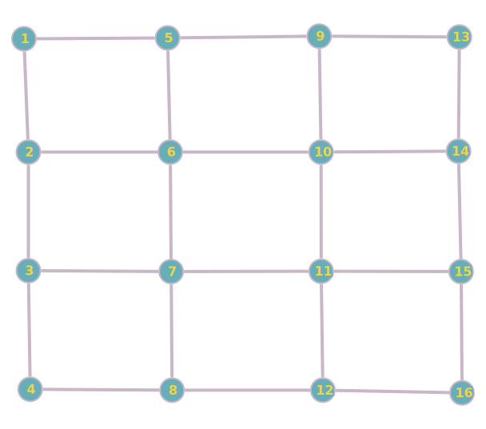

# Mysterious Island Game

## Como executar

Apos baixar o projeto certifique-se de ter instalado o [Node](https://nodejs.org/en). Você pode verificar a instalação por meio do comando abaixo:

```bash
node -v
```

Saída:

```bash
# A versão usada no desenvolvimento foi a v20.10.0
>> v20.10.0
```

Em seguida abra o [vscode](https://code.visualstudio.com/Download) a IDE de sua preferência. Abra a pasta do projeto no vscode em seguida abra o terminal no menu superior terminal


Com o terminal aberto digite o comando:

```bash
npm i
```

Isso fará o gerenciador de pacotes `npm` baixar todos os pacotes necessarios para a execução do codigo typescript descritos no arquivo `package.json`.

Por fim basta executar os seguinte(s) comando(s):

```bash
npm start # Isso fará a execução do codigo final
```

Nota: O vscode possibilita diversa extensões para automatização de diversas tarefas inclusive a execução sem uso do terminal.

## Mapa

A inspiração do mapa da ilha foi dada pelo grafo abaixo:

Onde o primeiro vertice é a praia e o último e o tesouro


